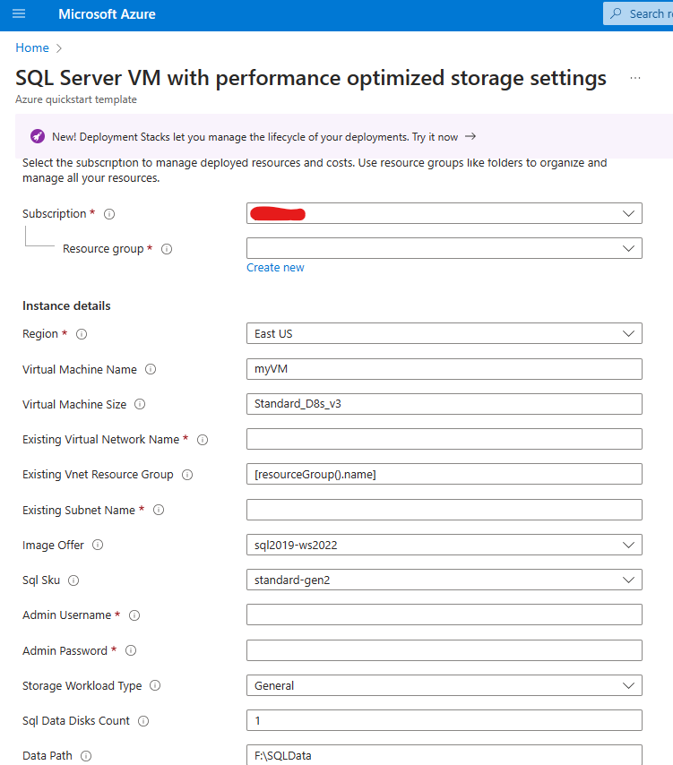
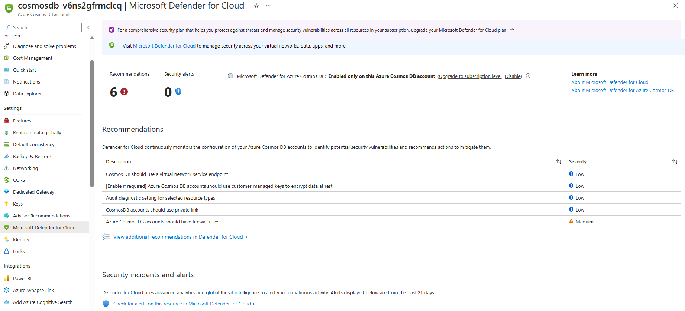

# Module 12 - Microsoft Defender for Cloud database protection

## 🎓 Level: 300 (Intermediate)

⌛ Estimated time to complete this lab: 60 minutes

## Objectives

This exercise guides you through Defender for Cloud's database protection plans. Database protection in Defender for Cloud contains four flavors:

1. Defender for SQL IaaS (SQL on Azure VM or outside of Azure): For this plan, agent-based [vulnerability assessment](https://learn.microsoft.com/en-us/azure/defender-for-cloud/sql-azure-vulnerability-assessment-overview) and [advanced threat protection](https://learn.microsoft.com/en-us/azure/azure-sql/database/threat-detection-overview?view=azuresql&toc=%2Fazure%2Fdefender-for-cloud%2Ftoc.json) are available to protect your Iaas SQL Servers.
2. Defender for SQL Paas (Azure SQL): For this plan, agentless vulnerability assessment and advanced threat protection are available to protect your SQL Servers as well as [data security posture management](https://learn.microsoft.com/en-us/azure/defender-for-cloud/concept-data-security-posture?view=azuresql). 
3. Defender for Open-source relational database:
Agentless advanced threat protection is available to protect your OSS databases. Read more about these security alerts [here](https://learn.microsoft.com/en-us/azure/defender-for-cloud/defender-for-databases-introduction). Data Security Posture Management and Advanced Threat Protection for AWS RDS resources are supported with this plan as well. 
4. Defender for Cosmos DB (NoSQL):
Agentless advanced threat protection is available to protect against Cosmos DB accounts. Read more about CosmosDB protection [here](https://learn.microsoft.com/en-us/azure/defender-for-cloud/concept-defender-for-cosmos).

### Exercise 1: Enable Defender for SQL servers on machines plan, create a SQL Server on an Azure VM, and validate findings and alerts

To enable the Defender plan on a specific subscription:

1. Sign into the **Azure portal**.
2. Navigate to **Microsoft Defender for Cloud**, then **Environment settings**.
3. Select the relevant subscription.
4. Locate **Databases**.
5. Click on **Select types** and ensure **SQL servers on machines** is toggled `On`.
6. Click **Continue** and **Save**.

Now all your existing and upcoming Arc-enabled SQL servers on machines are protected.

#### Create a SQL Server on a Windows Virtual Machine

1. use the ARM template to create a SQL server on a Windows Virtual Machine [here](https://learn.microsoft.com/en-us/azure/azure-sql/virtual-machines/windows/sql-vm-create-portal-quickstart?view=azuresql&tabs=conventional-vm) or, click on the blue **Deploy to Azure** button below:

    [![BlueAzurebutton][def]](<https://portal.azure.com/#create/Microsoft.Template/uri/https%3A%2F%2Fraw.githubusercontent.com%2FAzure%2Fazure-quickstart-templates%2Fmaster%2Fquickstarts%2Fmicrosoft.sqlvirtualmachine%2Fsql-vm-new-storage%2Fazuredeploy.json>) 

2. Click **Review and Create** and then when it's ready, click **Create**.

    

3. Once created, make sure **Defender for SQL on machines** plan is enabled.

4. Navigate to the virtual machine. Click on **Extensions + applications**. Notice two extensions: `MicrosoftDefenderforSQL` and `SqlIaasExtension`.

#### View and remediate vulnerability assessments
Vulnerability assessment will scan your SQL database and surface any deviations, misconfigurations and vulnerabilities. Read more about this [here](https://learn.microsoft.com/en-us/azure/defender-for-cloud/sql-azure-vulnerability-assessment-overview). 

There are two ways to view vulnerability assessment findings.
Through the individual server for a per-server aggregated view.  
1. Navigate to the SQL virtual machine resource in the Azure portal for the server-level view.
2. Follow the steps listed here: https://learn.microsoft.com/en-us/azure/defender-for-cloud/sql-azure-vulnerability-assessment-find?tabs=server-level#review-and-remediate-vulnerabilities-azure-portal
   
Through Defender for Cloud's recommendations for a per-database view.
1. Navigate to **Recommendations** in Defender for Cloud for database-level view.
2. Follow the steps listed here: https://learn.microsoft.com/en-us/azure/defender-for-cloud/sql-azure-vulnerability-assessment-find?tabs=database-level#review-and-remediate-vulnerabilities-azure-portal

#### Simulate alerts in Defender for SQL on machines
1. Validate the protection status on your machine by following instructions [here](https://learn.microsoft.com/en-us/azure/defender-for-cloud/verify-machine-protection#verify-protection-on-a-single-sql-server-vm).
2. Follow instructions [here](https://learn.microsoft.com/en-us/azure/defender-for-cloud/simulate-alerts-sql-machines#simulate-alerts) to run simulation.
>Note: Make sure to meet the pre-requisites, like the permissions required to deploy a custom extension and SQL authentication mode to the SQL server

### Exercise 2: Enable and protect your Azure SQL Databases using Microsoft Defender for Azure SQL Databases

Defender for Cloud protects your Azure SQL databases. 

#### Enable database protection on your Azure SQL Database

A SQL server should also have been created, earlier in module 1, and it should be labeled as “asclab-sql-[string]”. If so, you should also be able to locate your SQL database, labeled as “asclab-db”.

1. Sign into the **Azure portal**.
2. Navigate to **Microsoft Defender for Cloud**, then **Environment settings**.
3. Select the relevant subscription.
4. To protect all database types, toggle the Databases plan to **On**.
5. Select **Select types**.
6. Make sure **Azure SQL Database** has been toggled to **On**.
7. Select **Continue** and **Save**.

Now all your existing (asclab-db from Module 1) and upcoming Azure SQL Databases are protected.

#### Understand vulnerability assessment on your Azure SQL Database

This part of the exercise will leverage "asclab-db". VA experience is the same as exercise 1.

#### View and remediate vulnerability assessments
Vulnerability assessment will scan your SQL database and surface any deviations, misconfigurations and vulnurabilities. Read more about this [here](https://learn.microsoft.com/en-us/azure/defender-for-cloud/sql-azure-vulnerability-assessment-overview). 

There are two ways to view vulnerability assessment findings.
Through the individual server for a per-server aggregated view.  
1. Navigate to the SQL virtual machine resource **“asclab-db”** in the Azure portal for the server-level view.
2. Follow the steps listed here: https://learn.microsoft.com/en-us/azure/defender-for-cloud/sql-azure-vulnerability-assessment-find?tabs=server-level#review-and-remediate-vulnerabilities-azure-portal
   
Through Defender for Cloud's recommendations for a per-database view
1. Navigate to **Recommendations** in Defender for Cloud for database-level view.
2. Follow the steps listed here: https://learn.microsoft.com/en-us/azure/defender-for-cloud/sql-azure-vulnerability-assessment-find?tabs=database-level#review-and-remediate-vulnerabilities-azure-portal

### Explore Data Security Posture Management for your Azure SQL Databases
1. Follow the instructions in [module 23, exercise 5](https://github.com/Azure/Microsoft-Defender-for-Cloud/blob/main/Labs/Modules/Module%2023%20-%20Data%20security%20posture%20management.md#optional-upload-data-to-azure-sql-database) to upload sensitive data to your Azure SQL database. 
2. Follow instructions in module 23, [exercise 6](https://github.com/Azure/Microsoft-Defender-for-Cloud/blob/main/Labs/Modules/Module%2023%20-%20Data%20security%20posture%20management.md#exercise-6-explore-risks-with-cloud-security-explorer) to explore risk in Cloud Security Explorer, [exercise 8](https://github.com/Azure/Microsoft-Defender-for-Cloud/blob/main/Labs/Modules/Module%2023%20-%20Data%20security%20posture%20management.md#optional-exercise-8-explore-risks-through-attack-paths) to explore risks through attack paths, [exercise 10](https://github.com/Azure/Microsoft-Defender-for-Cloud/blob/main/Labs/Modules/Module%2023%20-%20Data%20security%20posture%20management.md#optional-exercise-10-data-security-dashboard-investigation) to explore the Data Security Dashboard. 

### Exercise 3: Enable and protect your OSS RDBs using Microsoft Defender for Open-source relational databases

Defender for Cloud protects PostgreSQL, MySQL flexible servers and AWS RDS databases including MariaDB.

#### Enable database protection for your open source relational databases

1. Sign into the **Azure portal**.
2. Navigate to **Microsoft Defender for Cloud**, then **Environment settings**.
3. Select the relevant subscription.
4. To protect all database types, toggle the Databases plan to **On**.
5. Select **Select types**.
6. Make sure **Open source relational Database** has been toggled **On**.
7. Select **Continue** and **Save**.

#### Create an Azure database for PostgreSQL flexible server

1. To create a PostgreSQL flexible server, follow these instructions [here](https://learn.microsoft.com/en-us/azure/postgresql/flexible-server/quickstart-create-server-portal).  
2. Fill in all the necessary fields.
3. Click **Review and Create** and then when it's ready, click
**Create**.
4. Once created, navigate to the resource.
5. Find **Defender for Cloud** under **Security** and make sure the database is **protected**.

#### Understand AWS RDS protection

Defender for Cloud extends its protection to AWS RDS. See this announcement here: [Microsoft Defender for Open-Source Relational Databases Now Supports Multicloud (AWS RDS)](https://techcommunity.microsoft.com/blog/microsoftdefendercloudblog/microsoft-defender-for-open-source-relational-databases-now-supports-multicloud-/4127655).
In addition to the advance threat protection capabilities for AWS RDS, Defender for open-source relational databases also bundles sensitive data discovery as part of its core value. 
Refer to Module 11 to familiarize yourself with the AWS connector in MDC. 

##### Enable and protect your AWS RDSs using Microsoft Defender for Open-source relational database plan:

1.	Sign into the Azure portal.
2.	Navigate to Microsoft Defender for Cloud, then Environment settings.
3.	Select the relevant AWS Connector.
4.	Navigate to Databases and then select Settings
5.	Expand list next to Open-source relational databases (preview)
6.	Toggle on Open-source relational databases (preview)
7.	Toggle on Sensitive data discovery 
    >Notice SQL Servers on machines – Defender for SQL protects SQL machines outside of Azure, including AWS. Azure Arc must be installed on those machines. 
8.	Click Save.

##### Create an RDS instance with sensitive information
1.	Sign into your AWS portal and create one of the supported RDS resources. 
2.	Upload sensitive data into the just created RDS database
    >Refer to [AWS doc](https://docs.aws.amazon.com/AmazonRDS/latest/UserGuide/mysql-importing-data-any-source.html) for assistance. 
3.	Wait 24 hours

##### Look for enriched findings in Cloud Security Explorer:
1.	Navigate to Cloud Security Explorer in Defender for Cloud 
2.	Under “Select resource types”, choose “Managed database (PaaS)” then “AWS RDS DB instances
3.	Click “+” to add another condition
4.	For “Select condition”, choose “Data” and then “Contains sensitive data”
5.	Click **Search**
6.	Your AWS RDS DB should populate in the Results section. 

Other places to look for findings:
 - **Alerts**: filter alerts by resources with sensitive data discovery findings
 - **Inventory**: filter RDS resources with sensitive data discovery findings
 - **Resource health**: enrichment with sensitive data discovery findings
 - **Attack path**: identify potential attack paths for RDS with sensitive data discovery findings

### Exercise 4: Explore Defender for Azure Cosmos DB

1. Deploy an Azure Cosmos DB by following the instructions [here](https://learn.microsoft.com/en-us/azure/cosmos-db/nosql/quickstart-portal).
2. Click **Deploy to Azure**.
3. Fill in all the necessary fields.
4. Click **Review and Create** and then when it's ready, click
**Create**.

#### Enable database protection on your CosmosDB

1. Sign in to the **Azure portal**.
2. Navigate to **Microsoft Defender for Cloud**, then **Environment settings**.
3. Select the relevant subscription.
4. Select **Database types** and toggle **Azure Cosmos DB** plan to **On**.
5. Select **Continue** and **save**.

Now all your existing and upcoming Azure Cosmos DB accounts are protected.

#### Understand Azure Cosmos DB protection

1. Sign into the **Azure portal**.
2. Navigate to the Azure Cosmos DB or to database directly by searching for it in the search box up top.
3. Click on **Microsoft Defender for Cloud** under **Settings**.

4. **Recommendations** and **Security incidents and alerts** should be available, if applicable.

### Continue with the next lab [Module 13: Defender for APIs](https://github.com/Azure/Microsoft-Defender-for-Cloud/blob/main/Labs/Modules/Module-13-Defender%20for%20APIs.md)

[def]: https://aka.ms/deploytoazurebutton/

